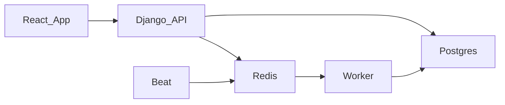
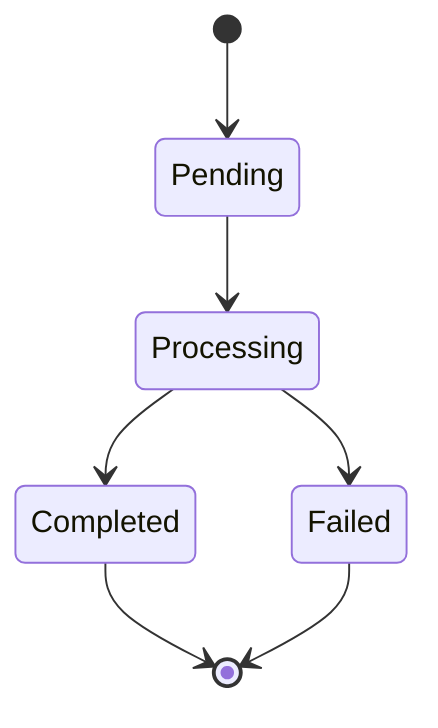
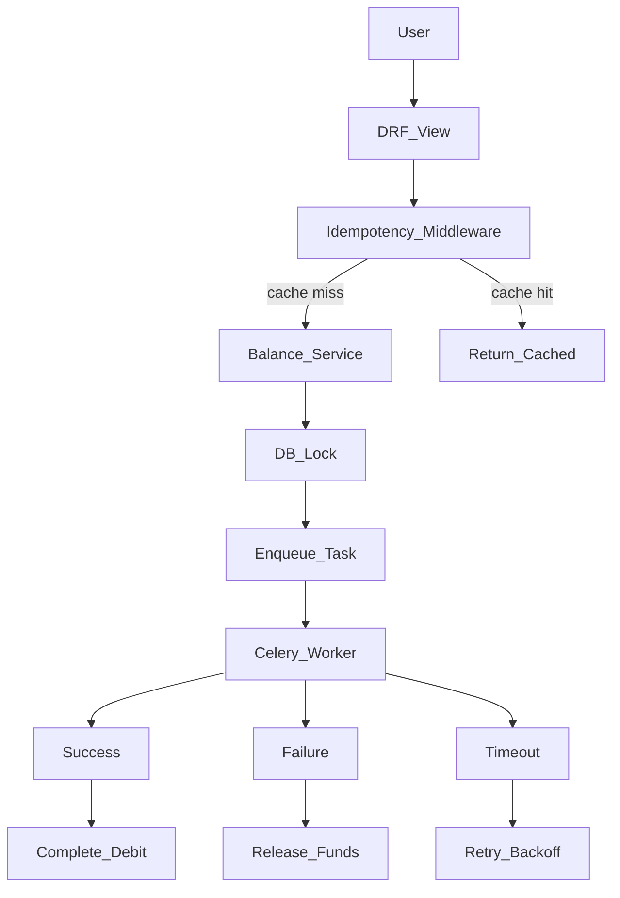

# Payout Engine — Comprehensive Explainer

this document consolidates design and implementation decision that i took for this project

demo link : https://drive.google.com/file/d/1s5idP4RBVRccNpUXCGr_Q20cLrNs4wOy/view?usp=sharing
---

## 1) Problem Statement

playto pay solves cross-border collections for merchants who cannot use stripe/paypal directly. in this assignment scope, collection is simulated (credits exist), and the core challenge is payout correctness:

- merchants have balances in paise.
- they request payouts.
- system holds funds, processes payout asynchronously, settles to completed/failed.
- if failed, held funds must be returned atomically.
- concurrency, idempotency, ledger correctness, and state machine integrity are mandatory.

this is a money-moving system where correctness > features and architecture > ui polish.

---

## 2) Goals And Non-Goals

### goals
1. accurate ledger and balances using integer paise.
2. safe concurrent payout requests (no overdraft race).
3. merchant-scoped idempotent payout creation with 24h key ttl.
4. strict payout state machine with legal transitions only.
5. async background processing + retry/backoff + timeout handling.
6. merchant dashboard showing available/held balances and payout history.
7. explainability via explainer.md with concrete code/query snippets.

### non-goals
1. real payment gateway integration.
2. full kyc/compliance workflow.
3. multi-currency ledger (only paise inr in this scope).
4. advanced auth/permissions platform (simple merchant auth acceptable).
5. full observability stack (basic logs/metrics acceptable).

---

## 3) Success Criteria which is important

1. **money integrity**
   - all amounts stored as integer paise (bigintegerfield).
   - no float arithmetic.
   - balance calculations done with db-level operations.
   - invariant holds: credits - debits == displayed balance.

2. **concurrency**
   - two simultaneous payout requests that jointly exceed balance must not both pass.
   - exactly one succeeds in the ₹100 + (₹60,₹60) scenario.

3. **idempotency**
   - same merchant + same idempotency key returns exact same response.
   - no duplicate payout created.
   - ttl expiration: 24h.

4. **state machine**
   - only:
     - pending → processing → completed
     - pending → processing → failed
   - illegal transitions blocked.

5. **retry logic**
   - processing >30s => retry with exponential backoff.
   - max 3 attempts.
   - then mark failed and release held funds atomically.

6. **delivery completeness**
   - django+drf backend, react+tailwind frontend.
   - postgresql.
   - real async worker (celery).
   - seed data.
   - tests (at least concurrency + idempotency).
   - deployment url.
   - clean docs + explainer.

---

## 4) Architecture & Stack

### why this stack
- **django + drf**: used for api layer and validation because it integrates tightly with postgresql transactions and provides built-in serialization/validation.
- **postgres** (not sqlite): required because `select_for_update()` only works on postgresql. sqlite silently ignores row-level locks, breaking concurrency safety tests.
- **celery + redis**: background worker and queue for async payout processing. workers run as separate processes so api stays fast.
- **celery beat**: periodic task scheduler for scanning stuck payouts and retry due jobs.
- **react + tailwind**: lightweight dashboard for visibility into balances, payouts, and ledger during testing.

### service split
- api: handles validation, idempotency lookup, balance hold, payout creation
- worker: processes pending payouts, simulates settlement outcomes, handles retries
- beat: schedules periodic scans for stuck/due payouts
- frontend: merchant dashboard with balance display, payout history, ledger, activity log



### container alignment
- verified postgres and redis container status before development.
- used `postgresql_host=127.0.0.1` with mapped ports to avoid `ident` auth issues.
- celery requires redis; without it, async payout processing and retries do not work.

---

## 5) Data Model & Money Handling

### why bigintegerfield in paise
- all money amounts stored as `bigintegerfield` in **paise** (1 inr = 100 paise).
- **no floatfield, no decimalfield** — floating point causes precision errors in financial systems.
- amounts display converted to rupees (divide by 100) in ui.

### ledger as source of truth
- `ledgerentry` model is append-only (never updated or deleted).
- balance is **derived** from ledger entries using database aggregation with `django.db.models.sum`.
- invariant: `sum(credits) - sum(debits) - sum(holds) = displayed balance`.
- available balance = total credits - total debits - total holds.
- held balance = sum of amounts in pending/processing payouts.

### balance model
- `merchantbalance` has two balances: `available_balance_paise` and `held_balance_paise`.
- this makes reservation explicit — funds in `held` cannot be spent again until payout completes or fails.

### models created
- **merchant**: id, name, email, timestamps
- **merchantbalance**: merchant_id (unique fk), available_balance_paise, held_balance_paise, version, timestamps
- **ledgerentry**: merchant_id, entry_type (credit, payout_hold, payout_release, payout_debit_final), amount_paise, payout_id, reference, created_at
- **bankaccount**: merchant_id, account_masked, ifsc, is_active, timestamps
- **payout**: merchant_id, bank_account_id, amount_paise, status (pending, processing, completed, failed), attempt_count, next_retry_at, failure_reason, idempotency_key, timestamps (created_at, updated_at, processing_started_at, completed_at, failed_at)
- **idempotencykey**: merchant_id, key, request_hash, response_status_code, response_body, resource_type, resource_id, state (in_progress, completed), expires_at, timestamps
- **payoutstatetransition**: payout_id, from_status, to_status, actor (system_worker, api, admin), metadata, created_at

### core invariants
1. available_balance_paise >= 0
2. held_balance_paise >= 0
3. balance snapshot equals ledger aggregate projection.
4. payout amounts always > 0.
5. no payout leaves completed or failed to any other state.
6. failed payout fund release and state change are atomic.
7. idempotency key uniqueness scoped by merchant for 24h validity.

---

## 6) Concurrency Control (Most Critical)

### why row-level locking
- used `select_for_update()` inside `transaction.atomic()` to lock the merchant's balance row before checking balance.
- pattern: **lock → read balance → check → deduct** all inside one atomic transaction.
- **do not** read balance in python → check in python → then write. that is the classic race condition.

### test scenario
- merchant has ₹100, two simultaneous ₹60 requests.
- exactly one succeeds (201), the other fails cleanly.
- final balance = ₹100 - ₹60 = ₹40 (not negative, not ₹100).
- only one payout record exists in pending/processing state.

### database primitive
- `select_for_update()` is a postgresql row-level lock that blocks the second transaction until the first commits or rolls back.
- alternative approaches (check constraint, f() expressions) are less explicit for this use case.

### row-level locking code
```python
with transaction.atomic():
    balance = MerchantBalance.objects.select_for_update().get(merchant=merchant)
    if balance.available_balance_paise >= amount:
        # atomic hold operation
```

---

## 7) Idempotency

### why persisted idempotency
- retries happen in real networks, so storing key + request hash is the safest way to avoid double debit.
- `idempotencykey` unique constraint on `(merchant_id, key)` — keys are scoped per merchant.

### idempotency flow
1. extract `idempotency-key` header from request.
2. compute stable request hash from method, path, and body.
3. lookup `idempotencykey` by (merchant_id, key).
4. if found and not expired:
   - if state=completed: return cached response (same status code, same body).
   - if state=in_progress: return 409 conflict.
5. if not found:
   - create idempotency row in state=in_progress.
   - process request.
   - update idempotency row to state=completed with response snapshot.

### ttl & cleanup
- keys expire after **24 hours**.
- cleanup handled by celery beat task runs daily, deletes expired idempotency keys.

### race between identical requests
- unique constraint on `(merchant, key)` catches race between two identical simultaneous requests.
- `get_or_create` or catch `integrityerror` handles this.

### idempotency check flow (code)
```
1. extract idempotency-key header
2. lookup idempotencykey by (merchant_id, key)
3. if found and not expired:
    - if state=completed: return cached response
    - if state=in_progress: return 409 conflict
4. if not found:
    - create idempotencykey with state=in_progress
    - process request
    - update idempotencykey to completed with response
```

---

## 8) State Machine

### allowed transitions
- `pending → processing` (worker picks up)
- `processing → completed` (settlement success)
- `processing → failed` (settlement failure or max retries)



### forbidden transitions
- `completed → any state` (terminal)
- `failed → any state` (terminal)
- `processing → pending` (never go backwards)

### enforcement
- implemented in model `clean()` method.
- also enforced in serializer validation.
- worker logic checks current state before allowing transition.

### state machine transitions (code)
```
allowed:
  pending → processing (worker picks up)
  processing → completed (settlement success)
  processing → failed (settlement failure or max retries)

forbidden:
  completed → any state
  failed → any state
  processing → pending (never go backwards)

enforced via:
  model.clean() for django validation
  serializer validation
  worker logic must check current state before transition
```

### fund release atomicity
- when transitioning to `failed`: return held funds to merchant balance **atomically** with state transition (same db transaction).
- when transitioning to `completed`: convert hold to final debit entry.

### fund release atomicity (code)
```python
with transaction.atomic():
    payout = Payout.objects.select_for_update().get(id=payout_id)
    if payout.status != 'processing':
        return  # already handled
    
    payout.status = 'failed'
    payout.failure_reason = reason
    payout.save()
    
    balance = MerchantBalance.objects.select_for_update().get(merchant=payout.merchant)
    balance.available_balance_paise += payout.amount_paise
    balance.held_balance_paise -= payout.amount_paise
    balance.save()
    
    LedgerEntry.objects.create(
        merchant=payout.merchant,
        entry_type='payout_release',
        amount_paise=payout.amount_paise,
        payout=payout
    )
```

---

## 9) Async Processing & Retry

### why async workers
- payout completion can be slow or flaky, so worker isolation keeps api latency low.
- api stays fast: validate → reserve funds → record intent → enqueue job → return.

### worker setup
- `process_pending_payouts` task: picks pending payouts, transitions to processing, simulates settlement.
- `retry_stuck_payouts` task: picks timed-out or due retries and requeues them.
- each task processes inside `transaction.atomic()` with proper locking.

### settlement simulation
- 70% chance → `completed`
- 20% chance → `failed` (release held funds)
- 10% chance → stays processing (simulates hang)

### retry logic
- payouts stuck in `processing` for more than **30 seconds** → retry.
- **exponential backoff**: retry at 30s, 60s, 120s (attempt 1, 2, 3).
- **max 3 attempts** after which mark failed and release funds.
- celery beat schedules periodic scan for stuck payouts (every 10-15 seconds).

### exponential backoff (timing)
```
attempt 1: immediate
attempt 2: wait 5 seconds
attempt 3: wait 25 seconds (5^2)
after 3 failures: mark failed
```
(note: actual system uses 30s, 60s, 120s as per main implementation)

### failure handler
- on failure: update payout status to failed, release held funds atomically, create ledger entry for payout_release.

---

## 10) Functional Requirements

### 4.1 merchant ledger
- merchant has:
  - available_balance_paise
  - held_balance_paise
- credits (simulated incoming customer payments) increase available balance.
- payout request creates a hold:
  - available decreases
  - held increases
- completed payout settles hold to final debit.
- failed payout reverses hold:
  - held decreases
  - available increases

### 4.2 payout request api
- post /api/v1/payouts
- headers:
  - idempotency-key: <merchant-scoped uuid>
- body:
  - amount_paise (integer > 0)
  - bank_account_id
- behavior:
  - create pending payout + hold funds if sufficient balance.
  - if same key repeated within 24h, return exact same response body/status.
  - if insufficient funds, reject cleanly.

### 4.3 payout processor
- async worker picks pending payouts.
- simulated settlement outcomes:
  - 70% completed
  - 20% failed (release held funds)
  - 10% remains processing/hung
- hung payouts retried with backoff and max attempts.

### 4.4 merchant dashboard
- show:
  - available balance
  - held balance
  - recent ledger events (credits/debits/holds/releases)
  - payout history + live status refresh
- actions:
  - create payout request

---

## 11) Non-Functional Requirements

1. consistency: acid transactions around balance mutations.
2. concurrency safety: row locks and atomic db updates.
3. durability: ledger is append-only for financial traceability.
4. auditability: every payout transition recorded.
5. performance: typical payout request <300ms excluding queueing.
6. recoverability: worker retries and safe failure handling.
7. idempotent api reliability: safe against client retries/timeouts.

---

## 12) API Design

### endpoints
- `post /api/v1/payouts`: create payout with idempotency
- `get /api/v1/payouts`: list with filters
- `get /api/v1/payouts/<id>`: detail
- `get /api/v1/balance`: current balance
- `get /api/v1/ledger`: ledger entries
- `post /api/v1/credits`: simulate incoming payment
- `get /api/v1/merchants`: list merchants (for selector)
- `get /api/v1/activity-log`: aggregated events from payout transitions, ledger, and idempotency

### request format
headers:
- authorization: bearer ...
- idempotency-key: 550e8400-e29b-41d4-a716-446655440000

body:
```json
{
  "amount_paise": 6000,
  "bank_account_id": "ba_123"
}
```

### response codes
- 201 created: payout created successfully
- 409 conflict: duplicate in progress or insufficient balance
- 400 bad request: validation error
- 200 (duplicate): same response returned for idempotent retry

### headers
- `idempotency-key`: merchant-supplied uuid
- `x-merchant-id`: merchant identifier

---

## 13) Scenario Analysis (8 Scenarios)

### scenario 1: normal payout (happy path)
1. merchant has 10000paise available, 0 held
2. post /api/v1/payouts with amount=6000
3. idempotency key check: new key, proceed
4. balance check: 10000 >= 6000 ✓
5. atomic transaction: create payout (pending), increment held_balance_paise, decrement available_balance_paise, create ledger entry
6. return 201 with payout object
7. celery task enqueued
8. worker picks up, simulates success (70% probability)
9. worker updates payout to completed, ledger entry for final debit
10. final state: available=4000, held=0, payout=completed

### scenario 2: concurrent payout race (100 + 60 + 60)
1. merchant has 10000paise available, 0 held
2. request a: post payout 6000paise (idempotency key a)
3. request b: post payout 6000paise (idempotency key b) — arrives before a commits
4. db transaction a: select for update on merchantbalance, balance=10000>=6000 ✓, update set available=4000,held=6000
5. db transaction b: select for update on merchantbalance, balance=4000<6000 ✗ → reject with 400 error
6. request c: post payout 6000paise (idempotency key c) — arrives after a but before b
7. db transaction c: select for update on merchantbalance, balance=4000>=6000? no → balance is actually 4000 held (not available for new payouts until a completes or fails)
8. held balance means those funds are reserved. so c should see available=4000, which is < 6000, so c also fails.
9. only one of a or b succeeds (whichever gets lock first)

**critical invariant**: `select_for_update()` ensures only one concurrent request modifies balance at a time.

### scenario 3: idempotent retry (same request sent twice)
1. client sends post /api/v1/payouts with idempotency key "key-123"
2. server creates idempotency record (state=in_progress), processes, returns 201
3. client timeout, client resends same request with same key
4. server finds existing key with state=completed, returns stored response (200, same body)
5. no new payout created. no duplicate fund hold.

**edge case**: what if first request is still processing when retry arrives?
- idempotency key state=in_progress
- return 409 conflict or wait/polling (decide: return 409 immediately)

### scenario 4: payout failure & fund release
1. payout in processing state (funds already held)
2. simulated settlement returns failure (20% probability)
3. worker executes atomic transaction:
   - update payout set status=failed, failure_reason=...
   - update merchant_balance set available+=amount, held-=amount
   - create ledger entry (payout_release)
4. merchant available balance restored

### scenario 5: worker timeout/hung payout (10%)
1. payout picked up by worker, status=processing
2. settlement simulation hangs (or >30s)
3. worker has timeout detection (celery task timeout)
4. on timeout: retry with exponential backoff
5. attempt 2: same process, timeout again
6. attempt 3: same process, timeout again
7. after max attempts: mark failed, release funds atomically

### scenario 6: insufficient balance
1. merchant has 5000paise available
2. post /api/v1/payouts with amount=6000
3. balance check: 5000 < 6000
4. return 400 bad request with error: "insufficient balance"
5. no payout created, no funds held

### scenario 7: bank account validation
1. post /api/v1/payouts with bank_account_id that doesn't exist
2. return 400 bad request: "invalid bank account"
3. no payout created

### scenario 8: idempotency key expiration
1. merchant creates payout with key "expire-test", 24h ttl set
2. after 24h, key record expires/is cleaned up
3. new request with same key is treated as new request
4. cleanup: celery beat task runs daily, deletes expired idempotency keys

---

## 14) Flow Diagrams

### payout request flow
```
┌─────────────┐     ┌──────────────┐     ┌────────────────┐     ┌────────────────┐
│   client    │────▶│  drf view    │────▶│ idempotency    │────▶│ balance check │
│             │     │              │     │ lookup        │     │ & hold        │
└─────────────┘     └──────────────┘     └────────────────┘     └────────────────┘
                                                                    │
                        ┌───────────────────────────────────────────┘
                        ▼
              ┌────────────────┐     ┌────────────────┐     ┌────────────────┐
              │ balance ok?    │────▶│ create payout │────▶│ enqueue task  │
              │              │ no  │ (pending)    │     │ (celery)     │
              └────────────────┘     └────────────────┘     └────────────────┘
                    │
                   yes
                    │
                    ▼
          ┌────────────────┐
          │ 201 created    │
          │ or 200 (dup)   │
          └────────────────┘
```

### async worker flow
```
┌────────────────┐     ┌────────────────┐     ┌────────────────┐
│  celery beat   │──���─���│  redis queue  │────▶│ worker process │
│  (schedules)  │     │                │     │                │
└────────────────┘     └────────────────┘     └────────────────┘
                                                     │
                         ┌───────────────────────────┘
                         ▼
              ┌────────────────┐     ┌────────────────┐
              │ simulate      │     │ update status  │
              │ settlement   │────▶│ (completed/   │
              │ (70/20/10%) │     │  failed)     │
              └────────────────┘     └────────────────┘
                         │
                    ┌────┴────┐
                    │ 10%     │
                    │ timeout │
                    └────┬────┘
                         ▼
              ┌────────────────┐     ┌────────────────┐
              │ retry with     │────▶│ max attempts  │
              │ exponential   │     │ reached?      │
              │ backoff      │     │              │
              └────────────────┘     └────────────────┘
                                      │
                                     yes
                                      │
                                      ▼
                           ┌────────────────┐
                           │ mark failed    │
                           │ release funds │
                           │ atomically    │
                           └────────────────┘
```

### fund flow states
```
state: available=10000, held=0

[request payout 6000paise]
                    │
                    ▼
state: available=4000, held=6000, payout: pending
                    │
                    ▼
         [worker picks up]
                    │
                    ▼
state: available=4000, held=6000, payout: processing
                    │
          ┌──────────┴──────────┐
          │                     │
     [success 70%]        [failed 20%]
          │                     │
          ▼                     ▼
state: available=4000,    state: available=10000,
held=0, payout: completed held=0, payout: failed
(ledger: final debit)     (ledger: hold released)

                               [timeout 10%]
                                    │
                                    ▼
                          [retry #1 - backoff]
                                    │
                              ┌─────┴─────┐
                           [success]  [failed]
                              │          │
                              ▼          ▼
                        completed    [retry #2]
                                          │
                                    ┌─────┴─────┐
                                 [success]  [retry #3]
                                                      │
                                                ┌─────┴─────┐
                                             [success]  [fail/max]
                                                      │
                                                      ▼
                                                mark failed
                                                release funds
```

---

## 15) Frontend Dashboard

### features
- displays **available balance** and **held balance** (converted to rupees).
- shows **payout history** table with status, amount, timestamps.
- shows **ledger entries** table.
- **payout creation form** with amount input and bank account selector.
- **merchant selector** dropdown for switching between merchants.
- **activity log** panel showing backend events.
- uses polling (every 2-5 seconds) for live status updates.

### why selector-based
- ui was previously pinned to one merchant via `vite_merchant_id`.
- added selector so multiple seeded merchants are visible for testing.

### why activity log
- surfaced backend events (payout state transitions, ledger entries, idempotency) in ui.
- keeps frontend logs consistent with actual backend state.

---

## 16) Seed Data

### expansion
- seeded 6 merchants total (loop-based for maintainability).
- each merchant gets a bank account and opening credit.
- refactored seeding into single list + loop.

---

## 17) Testing

### required tests
1. **concurrency test**: merchant with 10000 paise, two simultaneous 6000 paise requests, verify exactly one succeeds.
2. **idempotency test**: send same request twice with same key, verify identical response and only one payout record.

### bonus tests
- state machine: attempt illegal transition, verify rejection.
- insufficient funds: request payout exceeding balance, verify rejection.
- expired idempotency key: assert key older than 24h is not reused.

---

## 18) Deployment

### platform
- railway for deployment (chosen for free tier).
- unified root config `railway.json` with role-driven scripts.
- scripts select behavior by `service_role` (api, worker, beat, frontend).

### services
- postgresql provisioned (not sqlite).
- redis provisioned (for celery).
- django api running as api service.
- celery worker running as worker service.
- celery beat running as beat service.
- react frontend as frontend service.

---

## 19) Iteration Decisions (All 8 Iterations)

### iteration 1 — docker + local runtime alignment
- verified postgres container status and port mapping for `playtopay-postgres`.
- confirmed backend env uses `postgresql_host=127.0.0.1` and the mapped host port.
- started redis container `playtopay-redis` for celery broker/result backend.
- started and validated backend processes: django api, celery worker, and celery beat.

### iteration 2 — short architecture-first readme
- rewrote top-level `readme.md` to a short architecture-first format.
- added a mermaid architecture diagram.
- focused content on design decisions and rationale, not just setup commands.
- kept writing style concise and human, with lowercase body text as requested.

### iteration 3 — detailed backend document
- added `backend/readme.md` as a detailed backend deep dive.
- documented payout lifecycle, idempotency flow, state transitions, retry behavior, and data model choices.
- linked the top-level readme to the backend deep-dive document.

### iteration 4 — seed data expansion
- updated `backend/core/management/commands/seed_data.py` to seed 6 merchants total.
- refactored merchant seeding into a single list + loop for maintainability.
- each seeded merchant gets a bank account and opening credit.

### iteration 5 — merchant-aware dashboard
- added backend endpoint `get /api/v1/merchants` in:
  - `backend/core/views.py`
  - `backend/core/urls.py`
  - `backend/core/serializers.py`
- updated frontend api client (`frontend/src/api/client.js`) to accept per-request `merchantid`.
- updated dashboard (`frontend/src/pages/dashboard.jsx`) to:
  - load merchant list
  - render merchant selector dropdown
  - fetch summary/accounts/payouts/ledger per selected merchant
- updated payout form (`frontend/src/components/payoutform.jsx`) to submit using selected merchant id.
- updated app header text (`frontend/src/app.jsx`).

### iteration 6 — backend activity log surfaced in ui
- added backend endpoint `get /api/v1/activity-log` in:
  - `backend/core/views.py`
  - `backend/core/urls.py`
  - activity log aggregates and orders events from:
    - `payoutstatetransition`
    - `ledgerentry`
    - `idempotencykey`
- added frontend panel `frontend/src/components/activitylog.jsx`.
- wired dashboard data loading to fetch and show activity log per selected merchant.
- updated dashboard grid layout to show payouts, ledger, and activity side by side.

### iteration 7 — railway deployment config consolidation
- created unified root config `railway.json`.
- added role-driven scripts:
  - `railway/build.sh`
  - `railway/start.sh`
  - scripts select behavior by `service_role` (`api`, `worker`, `beat`, `frontend`).
- removed old per-service railway files:
  - `backend/railway.api.json`
  - `backend/railway.worker.json`
  - `backend/railway.beat.json`
  - `frontend/railway.json`

### iteration 8 — validation runs
- ran backend health checks: `python backend/manage.py check`.
- ran frontend production builds: `npm run build`.

---

## 20) Execution Phases

### phase 1: project foundation (setup)
- [x] initialize django project with drf
- [x] configure postgresql with bigint fields
- [x] set up celery with redis broker
- [x] configure tailwind + react frontend scaffold
- [x] write agents.md with commands for this project

### phase 2: backend core (data layer)
- [x] create merchant model
- [x] create merchantbalance model with version field
- [x] create ledgerentry model (append-only)
- [x] create bankaccount model
- [x] create payout model with status enum
- [x] create idempotencykey model
- [x] create payoutstatetransition model
- [x] run migrations
- [x] create seed data script

### phase 3: ledger & balance logic
- [x] implement balance check with select_for_update
- [x] implement atomic payout hold (available-, held+)
- [x] implement atomic payout release (available+, held-)
- [x] implement ledger entry creation
- [x] add admin property: balance == ledger.sum
- [x] write tests for balance invariants

### phase 4: api layer
- [x] post /api/v1/payouts with idempotency middleware
- [x] get /api/v1/payouts (list with filters)
- [x] get /api/v1/payouts/<id>
- [x] get /api/v1/balance
- [x] get /api/v1/ledger
- [x] post /api/v1/credits (simulate incoming payment)
- [x] authentication middleware (bearer token)

### phase 5: async worker
- [x] celery task: process_pending_payouts
- [x] simulated settlement logic (70/20/10)
- [x] timeout detection and retry logic
- [x] exponential backoff implementation
- [x] max attempts handling → fail + release
- [x] celery beat schedule for polling

### phase 6: frontend
- [x] dashboard layout
- [x] balance display (available/held)
- [x] payout history table
- [x] create payout form
- [x] live status refresh (polling)
- [x] error handling ui

### phase 7: testing & polish
- [x] concurrency test: 100+60+60 scenario
- [x] idempotency test: duplicate request
- [x] state machine test: illegal transitions blocked
- [x] integration test: full happy path
- [x] explainer.md with code snippets
- [x] deploy to railway
- [x] verify live url works

---

## 21) File Structure

```
play-to-pay/
├── backend/
│   ├── playtopay/
│   │   ├── settings.py
│   │   ├── celery.py
│   │   └── urls.py
│   ├── core/
│   │   ├── models.py          # all domain models
│   │   ├── serializers.py
│   │   ├── views.py
│   │   ├── services.py        # business logic
│   │   ├── idempotency.py     # idempotency middleware
│   │   └── tasks.py           # celery tasks
│   ├── manage.py
│   └── requirements.txt
├── frontend/
│   ���─��� src/
│   │   ├── components/
│   │   ├── pages/
│   │   ├── hooks/
│   │   └── app.tsx
│   └── package.json
├── railway/
│   ├── build.sh
│   └── start.sh
├── plan.md
├── explainer.md
├── execution_plan.md
├── changes.md
├── changes2.md
├── backend/
│   └── readme.md
└── readme.md
```

---

## 22) Dependency Map



---

## 23) Key Files

- `backend/core/models.py`: all domain models
- `backend/core/services.py`: business logic (idempotency, balance hold/release, transitions)
- `backend/core/views.py`: api endpoints
- `backend/core/tasks.py`: celery tasks for async processing
- `backend/core/idempotency.py`: idempotency middleware
- `backend/core/auth.py`: merchant authentication
- `frontend/src/pages/dashboard.jsx`: main dashboard
- `frontend/src/components/payoutform.jsx`: payout creation form
- `frontend/src/components/activitylog.jsx`: activity log panel
- `frontend/src/api/client.js`: api client with merchant support

---

## 24) Commands

```bash
# backend
python backend/manage.py migrate
python backend/manage.py seed_data
python backend/manage.py runserver
celery --app payouts worker --loglevel info
celery --app payouts beat --loglevel info

# frontend
cd frontend && npm install && npm run dev
```

---

## 25) Verification Checklist

before marking implementation complete, verify:

- [x] 10000paise merchant, request 6000, balance becomes 4000 available + 6000 held
- [x] second concurrent 6000 request fails with insufficient balance
- [x] same idempotency key returns identical response, no new payout
- [x] payout status transitions: pending → processing → completed/failed only
- [x] failed payout restores available balance
- [x] after 3 retries, hung payout marked failed, funds released
- [x] all amounts stored as integer paise, no float
- [x] ledger entries sum matches balance


---

## 27) Backend Deep Dive (Detailed)

### goal
the backend solves one core problem: create payouts safely without duplicate debits, even when requests retry or workers fail.

### what was done
- created a payout domain with explicit models for merchant, balance, payout, ledger, idempotency, and state transitions in `backend/core/models.py`.
- implemented service functions for hash-based idempotency, balance hold/release, transition rules, and credit handling in `backend/core/services.py`.
- built api endpoints for summary, bank accounts, credits, ledger, and payouts in `backend/core/views.py`.
- added async payout processing and retry scheduling with celery tasks in `backend/core/tasks.py`.
- configured celery beat schedules in `backend/payouts/settings.py`.
- added a custom test runner so `python backend/manage.py test` discovers core tests by default in `backend/core/test_runner.py`.

### how payout creation works (detailed 17-step flow)
1. client sends `post /api/v1/payouts` with `idempotency-key` and `x-merchant-id`.
2. api validates payload with drf serializer.
3. backend computes a stable request hash from method, path, and body.
4. backend tries to create idempotency row in `in_progress` state.
5. if key already exists:
6. same hash + completed state returns cached response.
7. same hash + in progress returns 409 to prevent overlap.
8. different hash returns conflict to block key misuse.
9. backend checks bank account ownership.
10. backend runs one transaction:
11. lock merchant balance row with `select_for_update`.
12. move funds from `available_balance_paise` to `held_balance_paise`.
13. create payout row in `pending`.
14. write ledger `payout_hold` entry.
15. record initial state transition.
16. save idempotency response snapshot.
17. enqueue worker job for execution.

### why these decisions
- **postgres as source of truth**: payout correctness depends on atomic updates and row locks, which map directly to postgres transaction features.
- **idempotency persisted in db**: retries happen in real networks, so storing key + request hash is the safest way to avoid double debit.
- **hold-first money flow**: moving money to `held` before processing prevents spending the same amount twice.
- **explicit state machine**: transitions are constrained to legal paths, which makes bugs easier to catch and audit.
- **async execution with celery**: payout completion can be slow or flaky, so worker isolation keeps api latency low.
- **beat-driven recovery**: periodic retry/timeout scanning handles hung jobs without manual operations.

### data model notes
- `merchantbalance` has two balances: `available` and `held`, so reservation is explicit.
- `payout` stores status, attempt count, retry time, and timing fields for lifecycle traceability.
- `ledgerentry` captures credit, hold, release, and final debit events for financial audit.
- `idempotencykey` stores request hash, cached response, ttl, and unique `(merchant, key)` constraint.
- `payoutstatetransition` keeps an append-only history of status changes and actor metadata.

### worker and retry logic
- `process_pending_payouts` pushes pending payout ids to worker queue in small batches.
- `process_single_payout` acquires row lock, enforces transition rules, and increments attempts.
- outcomes are simulated:
  - success path marks payout completed and converts held funds into final debit entry.
  - failure path marks payout failed and releases held funds back to available.
  - hang path sets `next_retry_at` using exponential backoff (`30s`, `60s`, `120s`).
- `retry_stuck_payouts` picks timed-out or due retries and requeues them.
- max attempts is capped to avoid infinite retry loops.

### auth and api shape
- merchant auth accepts `x-merchant-id` header or bearer token.
- all business endpoints use merchant-scoped queries so data access stays tenant-safe.
- payout endpoint returns deterministic responses for duplicate idempotent requests.

### current known edges
- worker outcomes are random right now to simulate a bank gateway; integrate a real provider adapter next.
- retries depend on running beat + worker continuously.
- test db teardown can fail if extra sessions are left open during failed test flows.

## 30) Priority Order what i build first 

1. **models** — merchant, ledgerentry, payout, idempotencykey
2. **seed script** — 6 merchants with credit history
3. **balance calculation** — db-level aggregation query
4. **payout api with concurrency + idempotency** — the core endpoint
5. **state machine** — transition validation
6. **celery worker** — process payouts with simulated settlement
7. **retry logic** — stuck payout detection + exponential backoff
8. **react dashboard** — display data + payout form
9. **tests** — concurrency test + idempotency test
10. **explainer.md** — answer all questions
11. **deploy** — railway with postgres + redis
12. **readme.md** — setup docs

this ordering ensures the hard parts (money integrity, concurrency, idempotency) are nailed first, which is what is explicitly graded on, before moving to the ui and deployment.
