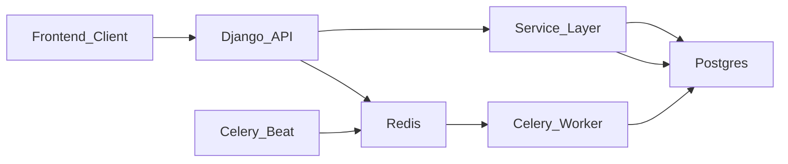

# Backend Deep Dive

this document explains what i built in the backend, why i structured it this way, and how each part works together.

## Goal

the backend solves one core problem: create payouts safely without duplicate debits, even when requests retry or workers fail.

## Stack

- django + drf for api and validation
- postgres for transactional money state
- celery worker for async payout execution
- celery beat for periodic scan and retry
- redis as broker/result backend for celery

## Architecture Diagram

## What I Did

- i created a payout domain with explicit models for merchant, balance, payout, ledger, idempotency, and state transitions in `backend/core/models.py:1`.
- i implemented service functions for hash-based idempotency, balance hold/release, transition rules, and credit handling in `backend/core/services.py:1`.
- i built api endpoints for summary, bank accounts, credits, ledger, and payouts in `backend/core/views.py:1`.
- i added async payout processing and retry scheduling with celery tasks in `backend/core/tasks.py:1`.
- i configured celery beat schedules in `backend/payouts/settings.py:109`.
- i added a custom test runner so `python backend/manage.py test` discovers core tests by default in `backend/core/test_runner.py:1`.

## How Payout Creation Works

1. client sends `post /api/v1/payouts` with `idempotency-key` and `x-merchant-id`.
2. api validates payload with drf serializer.
3. backend computes a stable request hash from method, path, and body.
4. backend tries to create idempotency row in `in_progress` state.
5. if key already exists:
6. same hash + completed state returns cached response.
7. same hash + in progress returns 409 to prevent overlap.
8. different hash returns conflict to block key misuse.
9. backend checks bank account ownership.
10. backend runs one transaction:
11. lock merchant balance row with `select_for_update`.
12. move funds from `available_balance_paise` to `held_balance_paise`.
13. create payout row in `pending`.
14. write ledger `payout_hold` entry.
15. record initial state transition.
16. save idempotency response snapshot.
17. enqueue worker job for execution.

## Why These Decisions

- postgres as source of truth: payout correctness depends on atomic updates and row locks, which map directly to postgres transaction features.
- idempotency persisted in db: retries happen in real networks, so storing key + request hash is the safest way to avoid double debit.
- hold-first money flow: moving money to `held` before processing prevents spending the same amount twice.
- explicit state machine: transitions are constrained to legal paths, which makes bugs easier to catch and audit.
- async execution with celery: payout completion can be slow or flaky, so worker isolation keeps api latency low.
- beat-driven recovery: periodic retry/timeout scanning handles hung jobs without manual operations.

## Data Model Notes

- `merchantbalance` has two balances: `available` and `held`, so reservation is explicit.
- `payout` stores status, attempt count, retry time, and timing fields for lifecycle traceability.
- `ledgerentry` captures credit, hold, release, and final debit events for financial audit.
- `idempotencykey` stores request hash, cached response, ttl, and unique `(merchant, key)` constraint.
- `payoutstatetransition` keeps an append-only history of status changes and actor metadata.

## Worker And Retry Logic

- `process_pending_payouts` pushes pending payout ids to worker queue in small batches.
- `process_single_payout` acquires row lock, enforces transition rules, and increments attempts.
- outcomes are simulated:
- success path marks payout completed and converts held funds into final debit entry.
- failure path marks payout failed and releases held funds back to available.
- hang path sets `next_retry_at` using exponential backoff (`30s`, `60s`, `120s`).
- `retry_stuck_payouts` picks timed-out or due retries and requeues them.
- max attempts is capped to avoid infinite retry loops.

## Auth And Api Shape

- merchant auth accepts `x-merchant-id` header or bearer token with merchant id in `backend/core/auth.py:1`.
- all business endpoints use merchant-scoped queries so data access stays tenant-safe.
- payout endpoint returns deterministic responses for duplicate idempotent requests.

## Commands I Used

- `python backend/manage.py migrate`
- `python backend/manage.py seed_data`
- `python backend/manage.py runserver`
- `celery --app payouts worker --loglevel info`
- `celery --app payouts beat --loglevel info`

## Current Known Edges

- worker outcomes are random right now to simulate a bank gateway; integrate a real provider adapter next.
- retries depend on running beat + worker continuously.
- test db teardown can fail if extra sessions are left open during failed test flows.
